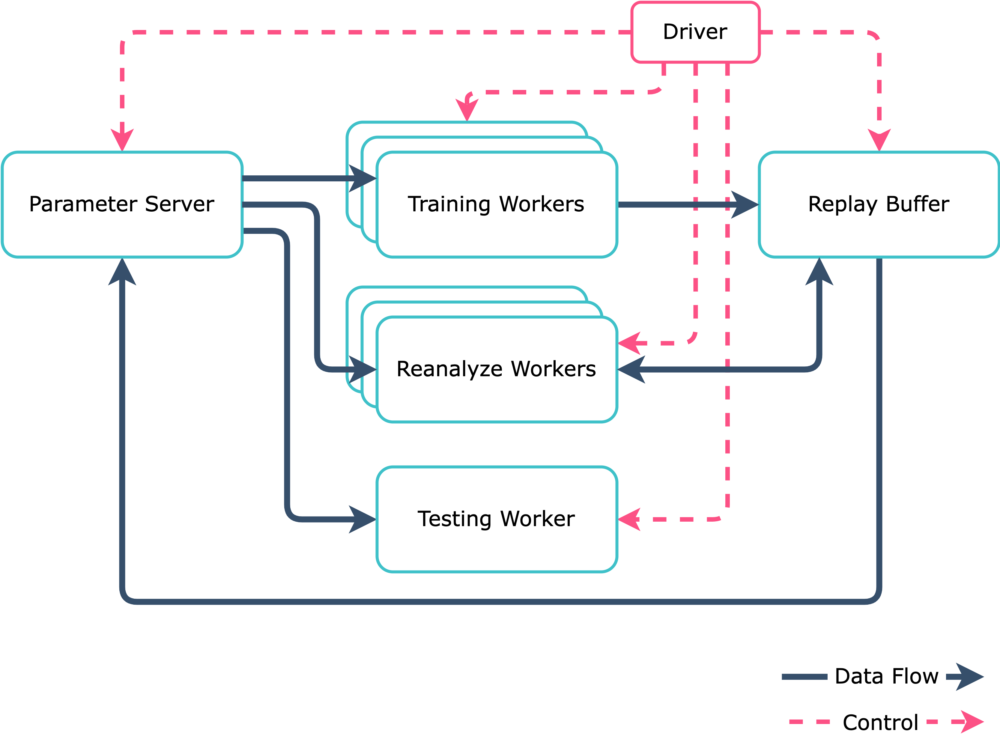
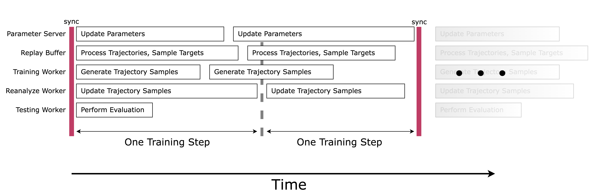
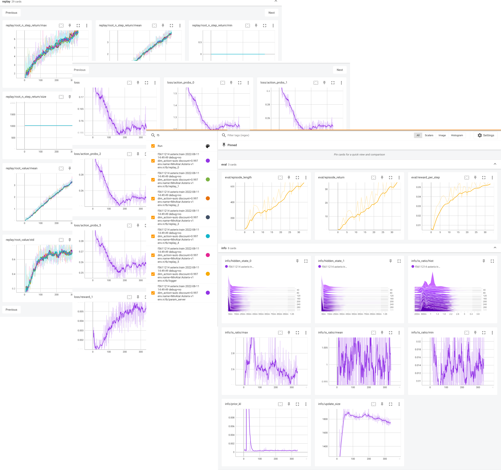
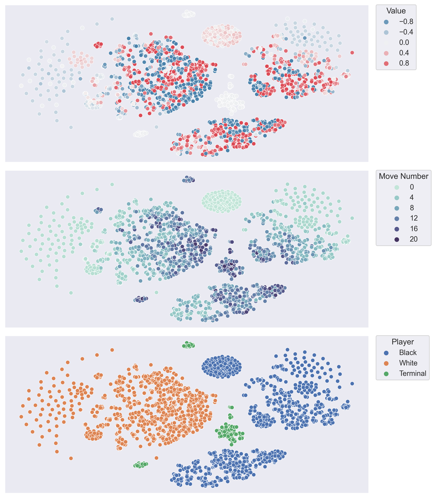

# MooZi: A General-Game-Playing System

*MooZi* is a high-performance general-game-playing system that plans with a learned model.
The *MooZi* core learning algorithm is based on [*MuZero*](https://www.deepmind.com/blog/muzero-mastering-go-chess-shogi-and-atari-without-rules) with a few extensions.
*MooZi* uses [JAX eco-system](https://www.deepmind.com/blog/using-jax-to-accelerate-our-research) and [Ray](https://github.com/ray-project/ray) for the best performance.

## Supported Games
*MooZi* current supports all [MinAtar](https://github.com/kenjyoung/MinAtar) games and some two-players games from [OpenSpiel](https://github.com/deepmind/open_spiel).

## Architecture
*MooZi* deploys a [hierarchial control](https://arxiv.org/abs/1712.09381) paradigm to parallizes its workers.

## Tools
*MooZi* is shipped with tools to help you montior understand the system.

### Tensorboard
*MooZi* Tensorboard hows all important metrics regarding the behavior and performance of the system.

 

### Hidden Space Visualizer
*MooZi* hidden space visualizer collects hidden states during acting and visualize them either in 3D or 2D.

